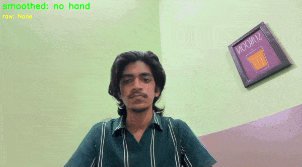

# Sign Language Detector

Real-time hand sign recognition in Python. A webcam feed goes through MediaPipe Hands (21 landmarks), a custom normalisation step, and a k-NN classifier, with a 10-frame majority vote to stop flicker.

*Originally a Class 12 group project in Python + NumPy; rebuilt independently so I understand every stage.*



## What it recognises

8 classes: `one`, `two` (also peace/victory), `three`, `four`, `five`, `thumbs_up`, `thumbs_down`, and `none` (fists, relaxed or random hand poses, so the model doesn't label every hand as a sign). Works with either hand, palm or back of the hand facing the camera.

## Pipeline

1. **OpenCV** reads the webcam and mirrors the frame.
2. **MediaPipe Hands** returns 21 landmarks per hand.
3. **Normalisation** (`features.py`): translate so the wrist is the origin, scale by the wrist-to-middle-finger-base distance, **no rotation**. Rotating to a fixed angle would erase the difference between thumbs up and thumbs down.
4. **k-NN (k=5)** classifies the 42 features. Random Forest was compared.
5. **Smoothing:** majority vote over the last 10 frames.

## Results

Trained on three sessions of my own hands (s1 right hand, s2 left hand, s3 both hands in different light and distance). Tested on f1: a friend's hands, both hands, both views, never used for training.

| | k-NN (k=5) | Random Forest |
|---|---|---|
| Leave-one-session-out (my hands only) | 98.5% | 98.4% |
| **New person (f1)** | **91.5%** | 86.7% |

New-person k-NN, per class (F1 score): thumbs_up 0.997, thumbs_down 0.984, one 0.966, two 0.961, none 0.918, five 0.860, three 0.818, four 0.777.

Full output: [`results/train_output.txt`](results/train_output.txt)

**How to read these numbers**
- The 98.5% is **not** a new-person result. All three sessions are the same person. The honest headline is 91.5% on one unseen person.
- f1 is one person, so the error bar is wide.
- I picked k-NN after seeing the f1 results, which is a small leak. Both models are reported for that reason.
- The live demo model is trained on **all** sessions including f1, so f1 no longer measures it. The 91.5% comes from the model trained without f1.

## Known weakness

Almost all new-person errors come from one cell: my friend's right hand seen from the back (78% accuracy, against 97-100% for the other three hand/view combinations). Mean fingertip positions for `four` and `five` were shifted about 0.5-0.8 hand-sizes sideways compared with mine in that cell, consistent with a tilted hand. Because normalisation deliberately doesn't rotate, tilt reaches the classifier as a different pose, and `four` is confused with `three`, and `five` with `none`. This is an inference from averages, not a proven cause.

**Next step:** rotation augmentation of about ±25° on training data only, tested on a second unseen person.

## Pose conventions

- Fingers point up for all number signs.
- Thumb tucked across the palm for 1-4, extended for 5.
- Peace/victory and "two" are the same hand shape, so they share one class.
- `none` contains no open hand with fingers up (it would look like `five`).

## Run it

**Requirements:** Python 3.12, a webcam, macOS (tested). On macOS, allow camera access for your terminal or VS Code when prompted.

**No webcam or don't want to install anything?** See the demo GIF above.

```
python3.12 -m venv venv
source venv/bin/activate
pip install -r requirements.txt

python train_final.py      # trains on data/samples.csv, saves models/knn.joblib
python live_predict.py     # press q to quit
```

Reproduce the evaluation: `python train.py`

Collect your own data (keys: 1-5, u, d, n to pick the class, v to toggle palm/back, space to record, q to quit):

```
python collect_data.py --person yourname --session s1
```

## Repo guide

| File | Purpose |
|---|---|
| `features.py`, `test_features.py` | Normalisation and its unit tests |
| `collect_data.py` | Key-press data collection tool |
| `inspect_data.py` | Counts per class, session, hand and view |
| `train.py` | Leave-one-session-out and new-person evaluation |
| `diagnose.py`, `diagnose2.py` | Error analysis behind the weakness section |
| `train_final.py`, `live_predict.py` | Final model and live demo |
| `landmark_viewer.py`, `test_camera.py` | Early setup checks |

## Notes

- Uses **MediaPipe 0.10.21** with the `mp.solutions` API. MediaPipe 1.0.1 crashed on my Mac when its Metal backend started, so I pinned the older version.
- MediaPipe already ships a pretrained Gesture Recognizer. I built my own pipeline to learn how each stage works, so this is a learning project, not a replacement for it.
- The dataset contains landmark coordinates only, with no images.

## Roadmap

Rotation augmentation and a second test person, a NumPy k-NN written from scratch (verified against scikit-learn), more signs (ASL letters), motion signs, and a Streamlit interface.